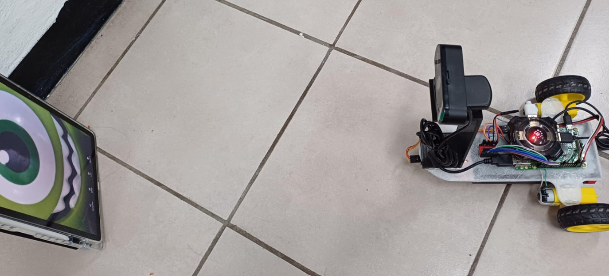

# 🤖 Proyecto: Carrito Seguidor de Objetos con Visión Artificial

## Resumen del Proyecto 
El Carrito Seguidor es un sistema de robótica móvil que utiliza Visión por Computadora (OpenCV) para detectar un objeto pre-entrenado (muñeco de Mike Wazowski) con un clasificador Haar, entrenado con Cascade Trainer GUI. Utiliza un lazo de Control Proporcional (P) para ajustar continuamente su velocidad y dirección, manteniendo una distancia objetivo y centrando el objeto.

El sistema se ejecuta en una Raspberry Pi y combina algoritmos de detección visual con lógica de control de bajo nivel para los motores. Además, incorpora un sensor Time-of-Flight (ToF) para la detección de obstáculos y la prevención de colisiones.

## 💻 Hardware y Componente

| Componente | Función Principal |
| :--- |:--- |
| **Raspberry Pi** | Microprocesador para el procesamiento de Visión Artificial y Control |
| **VL53L0X** | Sensor de Distancia para prevención de colisiones, conectado mediante I2C |
| **Puente H** | Control de potencia y dirección de los motores DC |
| **Webcam USB Steren** | Captura de video (320x240) para OpenCV |
| **Motores DC** | Movimiento del carro |

Para el control de Hardware se utilizó la librería WiringPi permitió la manipulación de GPIOs de la Raspberry Pi y SoftPWM para el control de los motores.

## ⚙️ Algoritmos de Control y Visión

1. **Detección y Distancia (Visión Artificial)**

    * **Cálculo de Distancia:** La distancia al objeto es calculada en tiempo real usando el tamaño detectado en píxeles (r.width) y la fórmula de perspectiva.
  Distancia (cm) = (Ancho Real x Distancia Focal Horizontal) / Tamaño en Pixeles

    * **Cálculo de Centroide:** El centro del objeto detectado se utiliza para calcular el error de posición con respecto al centro de la imagen.

2. **Control Propocional (P)**

   * **Control de Dirección:** Se aplican ganancias proporcionales diferentes para el giro a la izquierda y a la derecha para compensar las diferrencias de fricción de las llantas.
 
   * **Control de Avance:** Se incrementa la velocidad proporcionalmente a la distancia a la que se encuentra el objeto, para evitar perder la detección del objeto con la cámara. 

3. **Detección de Obstáculos y Búsqueda**

    * **Anti-Crashing (ToF)**: Si la distancia medida por el sensor VL53L0X es menor a 50mm, el carro detiene el avance y retrocede.

    * **Modo Búsqueda:** Si no se detecta el objeto por más de 20 segundos , el carro realiza un giro a la derecha para iniciar la búsqueda hasta que el objeto es detectado nuevamente.

## 🎥 Video Explicativo

[https://drive.google.com/file/d/1G1meEEWLdF-Nxf6JUZN0phEoZejRu9lK/view?usp=drivesdk](https://drive.google.com/file/d/1G1meEEWLdF-Nxf6JUZN0phEoZejRu9lK/view?usp=drivesdk)
  
## 🖼️ Montaje

